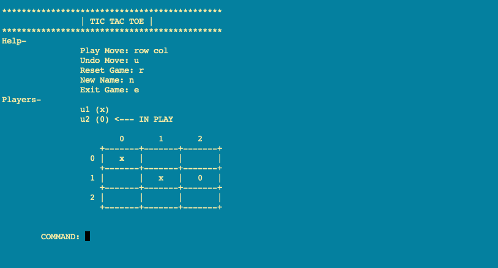

# Tictactoe

## About

* A Cli Tic Tac Toe game

## Prerequisites

* Jdk 8
* Maven

## Running Tic Tac Toe

### Building the Project

```console
mvn clean compile assembly:single
```

* The game can be run with or without initial arguments

### Running without Arguments

```console
java -cp target/tictactoe-1.0-jar-with-dependencies.jar com.abhisheksoni.tictactoe.Runner
```

### Running with Initial Arguments

```console
java -cp target/tictactoe-1.0-jar-with-dependencies.jar com.abhisheksoni.tictactoe.Runner StartGame 2 u1 x u2 0 3
```

### Alternate Run Script

* An alternate to the above, the convenience script `start.sh` or `start.bat` can be run
* This script would build and run the game

```console
sh start.sh
```

## Game Arguments

* `StartGame <Number of players> <User ids and symbol for each player separated by space> <Board size>`
* Example: StartGame 2 u1 x u2 0 3
* The symbol 'c' is reserved for a bot, if 'c' is supplied as a symbol for a player, it becomes a bot.

## Game Play Commands

| Action    | Command          |
|-----------|------------------|
| Play Move | \<row> \<column> |
| Undo      | u                |
| Reset     | r                |
| New Game  | n                |
| Exit Game | e                |

## Game in Action


